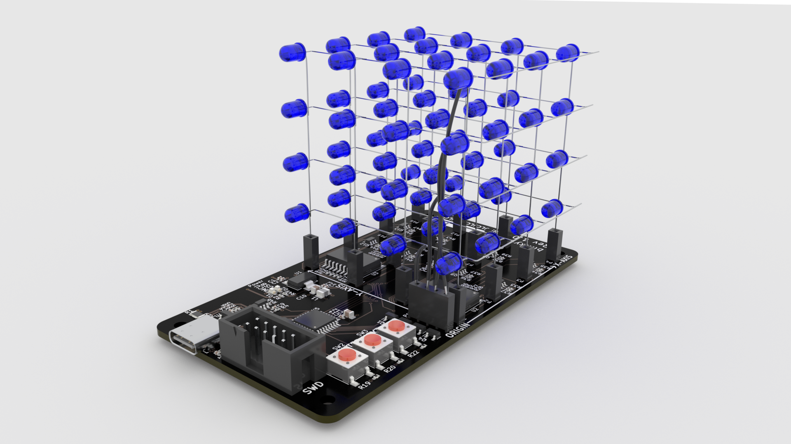
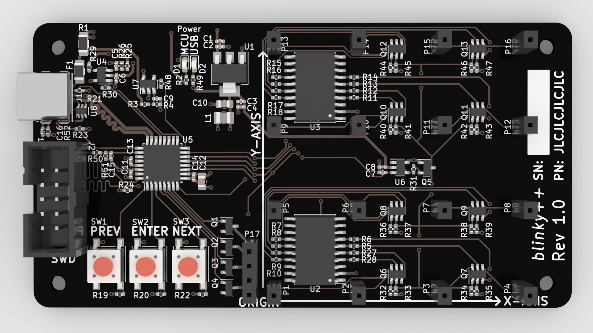

# blinky++ - An LED cube with some neat features

## Status

**This project has not yet been tested.  Boards are on their way and bring-up FW writing is in-progress.**

## Features

* Multiplex layers at >=120 Hz to create a persistence-of-vision effect
* USB-C for power and communications (except flashing)
    * Set current limit based on CC1 and CC2 voltage (not USB PD)
* Headers to allow for removal of the LED cube
* 30mA per LED
* Buttons to change displayed LED patterns
* Adjustable brightness
    * Limit brightness based on USB current limit determined above

## Hardware

* 2-layer board
* Less than 100x100mm (most budget PCB fabs have a significant price jump for dimensions larger than this)
* SAMD21-based
